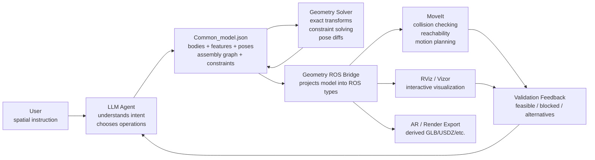
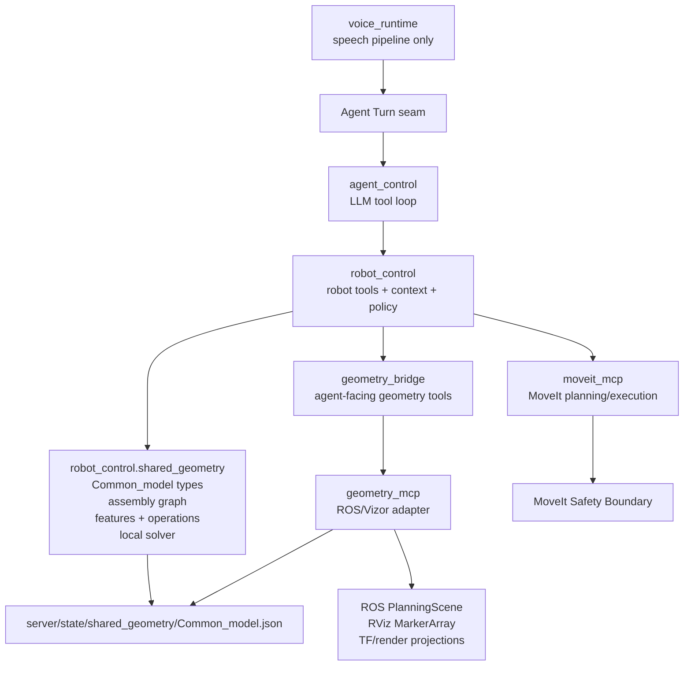
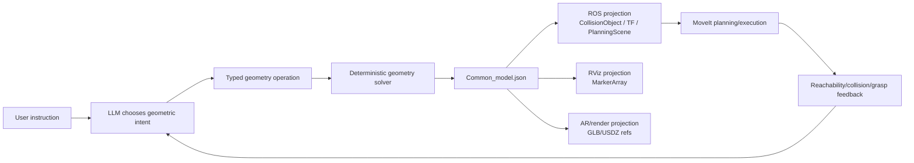
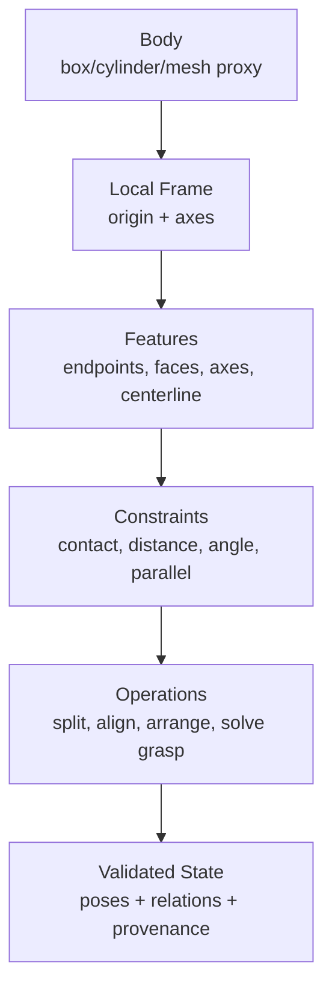
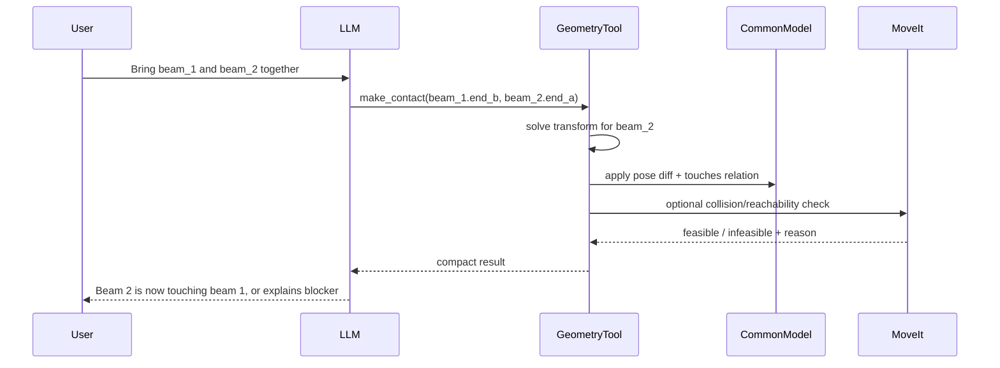
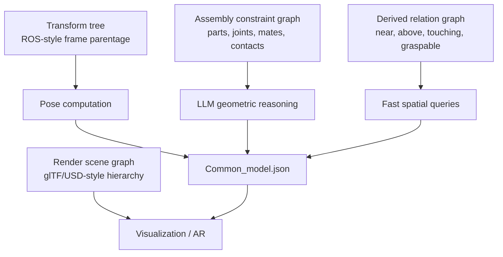
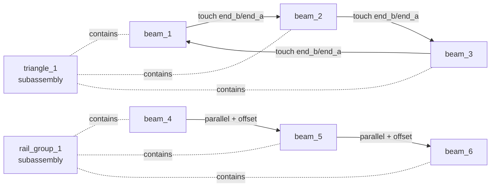
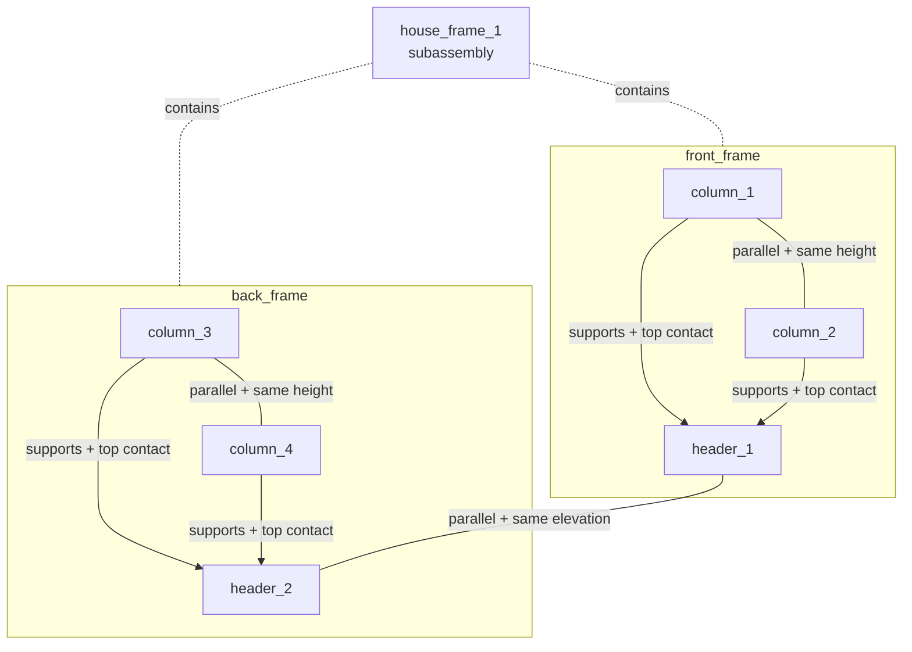

# Shared Geometry Model Research

Date: 2026-05-12

This note captures the conversation and research direction for `Common_model.json`, a proposed shared geometry model between the agent and the ROS/Vizor/RViz environment.

## Current Thesis

`Common_model.json` should be a **typed geometric operation model**, not a semantic scene graph and not a render asset.

The LLM should work with:

- abstract bodies such as boxes, cylinders, capsules, planes, lines, and simple meshes when needed;
- explicit local frames and dimensions;
- geometric features such as endpoints, faces, axes, centerlines, corners, and grasp regions;
- constraints such as contact, coincidence, parallelism, perpendicularity, distance, angle, clearance, containment, and reachability requests;
- operation records such as split, align, make contact, arrange, and solve grasp pose.

A deterministic geometry/robot layer should solve exact transforms, validate constraints, project the state into ROS/MoveIt/RViz/AR, and report back concise results.

## Chosen Direction

Use a **graph-backed geometry operation model**.

`Common_model.json` should contain the primitive geometry, generated features, transforms, and a lightweight `assembly_graph`. The graph represents bodies, subassemblies, and constraints such as contact, support, parallelism, alignment, and span relationships.

The LLM uses the graph to reason about structure and intent. Deterministic tools use the primitive geometry and constraints to compute exact poses, validate them, and project them into ROS, MoveIt, RViz, and AR.

Start with one file:

- `Common_model.json`: bodies, poses, features, constraints, assembly graph, relations, and optional operation history.

Split later only if needed:

- `Common_model.json`: numeric geometry and poses.
- `Common_graph.json`: assembly/subassembly graph and derived relationships.

The one-file version is the v0.1 best choice because it keeps IDs, constraints, and geometry synchronized while the model is still evolving.

### High-Level Responsibility Diagram



## Implementation Placement Recommendation

Given the current `pipecat-agent/ARCHITECTURE.md`, implement the Shared Geometry Model as a new deep Module under **Robot Control**, with a separate ROS-side adapter beside the existing MoveIt MCP.

Recommended v0.1 placement:

```text
pipecat-agent/
  server/
    robot_control/
      shared_geometry/
        model.py          # Common_model.json types and invariants
        graph.py          # assembly graph helpers
        features.py       # box endpoints, faces, axes, corners
        operations.py     # split, contact, align, subassembly operations
        solver.py         # deterministic pose diffs and constraint checks
        store.py          # load/save Common_model.json from local runtime state
      geometry_bridge.py  # agent-facing bridge to geometry MCP or local solver
      geometry_validation.py

Multi-Actor-Interface-Library/
  geometry_mcp/           # new ROS/Vizor geometry adapter, beside moveit_mcp
    server.py
    tools.py
    ros_projection.py     # PlanningScene / CollisionObject / MarkerArray
    render_projection.py  # optional GLB/USDZ export later
```

Runtime state:

```text
pipecat-agent/server/state/shared_geometry/Common_model.json
```

`server/state/` is already ignored local runtime state, so it is a good home for the live model file. Example fixtures and schema files should be committed separately under tests or docs.

### Why This Placement Fits The Current Architecture

The Shared Geometry Model is robot-side spatial context. It belongs with **Robot Control Module**, not **Voice Runtime** or **Agent Control Module**.

- **Voice Runtime** should stay audio-only.
- **Agent Control Module** should choose tools and run the model loop, but not own geometry math or ROS projections.
- **Robot Control Module** should expose geometry tools and structured feedback to Agent Control.
- **MoveIt MCP** should remain the movement-safety and motion-planning adapter.
- A new `geometry_mcp` should own ROS/Vizor/RViz projections of `Common_model.json`.

This creates two useful seams:

1. `robot_control.shared_geometry`: pure, testable geometry model and solver with no Pipecat, LangChain, MCP, or ROS imports.
2. `geometry_mcp`: concrete ROS/Vizor adapter that projects validated geometry into PlanningScene, RViz markers, and later AR/render artifacts.

The deletion test supports this split: if `shared_geometry` were deleted, assembly graph reasoning, feature generation, constraints, and operation solving would reappear across Agent Control prompts, Robot Context, MCP adapters, and tests. Keeping it as one deep Module concentrates that complexity.

### Module Responsibility Diagram



Do not put the core model directly inside `moveit_mcp`. That would make the movement adapter responsible for assembly modeling, graph reasoning, rendering projection, and geometry persistence. It would reduce locality and make future AR/RViz-only use cases depend on the motion-planning adapter.

## Conversation Decisions

- The model is primarily for **geometry**, not general robot memory.
- Semantic identity is secondary. Stable IDs and minimal labels are useful only to reference objects and improve reasoning.
- Abstract primitives are preferred over raw meshes as the LLM-facing representation.
- Exact render/planning geometry should usually be derived or referenced, not embedded inline.
- Three.js is relevant because LLMs do well with primitive constructors and transforms, not because Three.js JSON should become the canonical model.
- The model must support geometric manipulation commands such as:
  - "make a triangle of the 3 beams"
  - "split beam 1 in thirds"
  - "bring those two beams together so they are touching"
  - "position this beam so the robot can grasp it"
- The relevant research frame is closer to parametric CAD, geometric constraint solving, and robot manipulation constraints than to semantic scene graphs.

The project glossary was updated in `pipecat-agent/CONTEXT.md`:

> **Shared Geometry Model**: A geometry-operation model, expressed as abstract primitives, transforms, geometric features, and constraints, exchanged between the agent and the ROS/Vizor environment for spatial manipulation and synchronization.

## Why Not Raw ROS, glTF, USD, or Three.js As Canonical State?

These formats are useful projections, not the best LLM-facing source of truth.

- ROS/MoveIt messages are excellent for planning and execution, but are operation- and middleware-shaped. `moveit_msgs/CollisionObject` mixes ID, frame, primitive arrays, meshes, subframes, and ADD/REMOVE/MOVE operations.
- RViz markers are visualization artifacts.
- glTF/GLB and USD/USDZ are asset/render/interchange formats, optimized for graphics pipelines rather than readable geometric manipulation intent.
- Three.js code works well for LLMs because it exposes compact constructors like `BoxGeometry(width, height, depth)` plus `Object3D.position/quaternion/scale`. The lesson is to copy that abstraction, not to use Three.js serialization as the robot model.

## Research Evidence

### Geometric Constraints For Manipulation

[GeoManip](https://arxiv.org/abs/2501.09783) is the closest conceptual match. It frames robot manipulation as geometric constraints derived from task descriptions, interpreted through symbolic language, and solved into low-level actions.

Implication: the LLM should produce constraints and task-relevant geometry handles; a solver should optimize robot poses and trajectories.

### LLMs Inferring Spatial Constraints, Solvers Executing

[VoxPoser](https://arxiv.org/abs/2307.05973) shows a useful split: LLMs infer affordances and constraints from free-form language, then a model-based planning framework synthesizes 6-DoF end-effector waypoints.

Implication: the LLM can decide "approach from top, grasp across width, keep clearance" while MoveIt and geometry tools verify feasibility.

### Parametric CAD As The Better Analogy

[Vitruvion](https://arxiv.org/abs/2109.14124) describes parametric CAD as geometric primitives plus parameterized constraints. Edits propagate coherently because the design is a constraint program.

[SketchGen](https://arxiv.org/abs/2106.02711) describes CAD sketches as graphs where primitives are nodes and constraints are edges.

Implication: `Common_model.json` should encode design/manipulation intent as primitives plus constraints, not only current object poses.

### Structured Geometry Language Beats Mesh Dumps

[SceneScript](https://arxiv.org/abs/2403.13064) reconstructs scenes as structured language commands rather than meshes, voxels, point clouds, or radiance fields.

Implication: an operation DSL like `split_body`, `make_contact`, and `arrange_closed_chain` is aligned with how token models handle geometry.

### Geometric Decomposition For Grasp Reasoning

[ShapeGrasp](https://shapegrasp.github.io/) decomposes unfamiliar objects into simple convex shapes represented in a graph with geometric attributes and spatial relationships, then uses the LLM for task-oriented grasp selection.

Implication: beams and parts should expose geometric features and grasp regions, not only object names.

### ROS Infrastructure To Reuse As Projections

- [`shape_msgs/SolidPrimitive`](https://docs.ros.org/en/noetic/api/shape_msgs/html/msg/SolidPrimitive.html): boxes, spheres, cylinders, cones.
- [`moveit_msgs/CollisionObject`](https://docs.ros.org/en/noetic/api/moveit_msgs/html/msg/CollisionObject.html): planning-scene collision objects, poses, subframes, meshes, operations.
- [`visualization_msgs/Marker`](https://docs.ros.org/en/noetic/api/visualization_msgs/html/msg/Marker.html): RViz display primitives and mesh resources.
- [ROS REP-103](https://www.ros.org/reps/rep-0103.html): SI units, right-handed frames, x forward, y left, z up, quaternion preferred.
- [MoveIt Planning Scene ROS API](https://moveit.github.io/moveit_tutorials/doc/planning_scene_ros_api/planning_scene_ros_api_tutorial.html): use synchronous `apply_planning_scene` when the agent needs confirmation that geometry was applied.

## Architecture Diagram



The LLM is not the geometric kernel. It chooses the right operation and constraints. The solver and MoveIt validate the result.

## Data Model Layers



## Constraint-Solving Pattern



## Candidate `Common_model.json` Shape

```json
{
  "schema_version": "0.1",
  "units": "m",
  "root_frame": "base_link",
  "bodies": [
    {
      "id": "beam_1",
      "solid": {
        "type": "box",
        "dimensions": { "x": 0.9, "y": 0.08, "z": 0.08 },
        "local_axes": {
          "length": "+x",
          "width": "+y",
          "height": "+z"
        }
      },
      "pose": {
        "frame": "base_link",
        "xyz": [0.2, 0.0, 0.04],
        "quat_xyzw": [0.0, 0.0, 0.0, 1.0]
      },
      "features": {
        "center": { "type": "point", "local_xyz": [0.0, 0.0, 0.0] },
        "end_a": { "type": "point", "local_xyz": [-0.45, 0.0, 0.0] },
        "end_b": { "type": "point", "local_xyz": [0.45, 0.0, 0.0] },
        "axis_length": { "type": "axis", "direction": "+x" },
        "face_top": { "type": "plane", "normal": "+z", "offset": 0.04 },
        "face_bottom": { "type": "plane", "normal": "-z", "offset": -0.04 }
      }
    }
  ],
  "constraints": [],
  "relations": []
}
```

## Operation Examples

### Make Three Beams Into A Triangle

User says:

> Hey, make a triangle of the 3 beams.

LLM emits:

```json
{
  "op": "arrange_closed_chain",
  "body_ids": ["beam_1", "beam_2", "beam_3"],
  "shape": "equilateral_triangle",
  "plane": "base_link.xy",
  "center": [0.5, 0.0, 0.04],
  "connection": {
    "type": "point_contact",
    "sequence": [
      ["beam_1.end_b", "beam_2.end_a"],
      ["beam_2.end_b", "beam_3.end_a"],
      ["beam_3.end_b", "beam_1.end_a"]
    ]
  }
}
```

Solver returns pose diffs and relations:

```json
{
  "ok": true,
  "updated_bodies": ["beam_1", "beam_2", "beam_3"],
  "relations": [
    { "type": "touches", "a": "beam_1.end_b", "b": "beam_2.end_a" },
    { "type": "touches", "a": "beam_2.end_b", "b": "beam_3.end_a" },
    { "type": "touches", "a": "beam_3.end_b", "b": "beam_1.end_a" }
  ]
}
```

### Split Beam 1 In Thirds

User says:

> Split beam 1 in thirds.

LLM emits:

```json
{
  "op": "split_body",
  "body_id": "beam_1",
  "axis": "local_x",
  "segments": 3,
  "new_ids": ["beam_1_a", "beam_1_b", "beam_1_c"],
  "preserve_total_length": true,
  "preserve_cross_section": true
}
```

Solver creates three new boxes of length `0.3 m`, placed along the original beam axis.

### Bring Two Beams Together

User says:

> Bring those two beams together so they are touching.

After reference resolution, LLM emits:

```json
{
  "op": "satisfy_constraint",
  "move": "beam_2",
  "constraint": {
    "type": "coincident_points",
    "a": "beam_1.end_b",
    "b": "beam_2.end_a"
  },
  "preserve_orientation": true
}
```

For face contact:

```json
{
  "op": "satisfy_constraint",
  "move": "beam_2",
  "constraint": {
    "type": "plane_contact",
    "a": "beam_1.face_top",
    "b": "beam_2.face_bottom",
    "normal_alignment": "opposed"
  }
}
```

### Position A Beam So The Robot Can Grasp It

The model should include robot and gripper geometry context, separate from movement safety:

```json
{
  "robot_context": {
    "planning_frame": "base_link",
    "tcp_frame": "tool0",
    "gripper": {
      "max_opening_m": 0.12,
      "finger_depth_m": 0.04,
      "preferred_closing_axis": "local_y"
    }
  }
}
```

LLM emits:

```json
{
  "op": "solve_grasp_pose",
  "body_id": "beam_1",
  "target_feature": "center",
  "grasp_rule": {
    "type": "pinch_box",
    "close_across": "beam_1.width",
    "approach_from": "beam_1.face_top",
    "required_clearance_m": 0.03
  },
  "checks": ["gripper_width", "approach_clearance", "moveit_reachable"]
}
```

The geometry layer can reason that beam width is `0.08 m`, gripper max opening is `0.12 m`, and top approach needs `0.03 m` clearance. MoveIt then validates reachability/collision.

## Why This Should Work

This approach gives the LLM exactly the handles it needs:

- human-understandable IDs;
- simple solids instead of opaque mesh buffers;
- local axes and features so operations can refer to geometry directly;
- constraints as first-class records, matching CAD and manipulation research;
- deterministic solvers for transforms, distances, collisions, and robot checks.

It avoids asking the LLM to be a numerical CAD kernel. The LLM performs symbolic geometric planning; tools perform exact geometry and robot validation.

## Proposed Tool Boundary

Agent-facing tools should stay narrow:

- `geometry_get_model`
- `geometry_query_feature`
- `geometry_apply_operation`
- `geometry_solve_constraints`
- `geometry_preview_diff`
- `geometry_apply_to_moveit`
- `geometry_solve_grasp_pose`

Do not expose broad raw ROS topic mutation to the agent by default.

## Graph Layer Recommendation

Yes: the model should include a graph layer. The graph should represent **assembly and constraint structure**, not replace the primitive geometry records.

Recommended split:

- `bodies`: authoritative geometric objects, dimensions, poses, frames, and generated features.
- `assembly_graph`: stable graph over bodies, subassemblies, and constraints.
- `relations`: derived or observed relationships such as touching, parallel, above, near, connected, or graspable.
- `operation_history`: optional provenance for how the graph reached its current state.

The graph can live inside `Common_model.json` for v0.1. If it grows large, it can later move to `Common_graph.json` while keeping IDs shared between both files. Start in one file to reduce synchronization risk.

### Why A Graph Helps

A graph helps the LLM because many useful geometric questions are relational:

- Which beams are connected?
- Which object should move if preserving the assembly?
- Which constraints define this triangle?
- What subassembly behaves as one rigid group?
- Which face or endpoint is available for a grasp?
- Which operation would break an existing contact?

This matches CAD assembly practice. AutoMate describes CAD assemblies as pairwise mate constraints between parts, and JoinABLe notes that Fusion 360 assemblies include joints, contact surfaces, holes, and underlying assembly graph structure. ShapeGrasp is also relevant: it decomposes objects into simple shapes and gives the LLM a graph with geometric attributes and spatial relationships for grasp selection.

The graph does **not** make the LLM a geometry solver. It gives the LLM a compact symbolic map of the structure, while the solver computes exact transforms and MoveIt checks feasibility.

### Graph Types To Keep Separate



ROS `tf` is a tree of coordinate frames over time. glTF uses a node hierarchy as a scene graph for transforms and rendering. Those are useful projections, but the LLM-facing graph should be the assembly graph: nodes are bodies/features/subassemblies, and edges are constraints or relationships.

### Candidate Graph Shape

```json
{
  "assembly_graph": {
    "nodes": [
      { "id": "beam_1", "type": "body" },
      { "id": "beam_2", "type": "body" },
      { "id": "triangle_1", "type": "subassembly", "members": ["beam_1", "beam_2", "beam_3"] }
    ],
    "edges": [
      {
        "id": "joint_1",
        "type": "point_contact",
        "a": "beam_1.end_b",
        "b": "beam_2.end_a",
        "status": "satisfied",
        "rigid": false
      },
      {
        "id": "align_1",
        "type": "parallel_axes",
        "a": "beam_1.axis_length",
        "b": "beam_4.axis_length",
        "status": "desired"
      }
    ]
  }
}
```

### Whole-Assembly Example

For a six-beam structure, the graph can represent both local contacts and higher-level assemblies:



This lets the LLM reason at two levels:

- local: move `beam_2` until `beam_2.end_a` touches `beam_1.end_b`;
- assembly: move `triangle_1` as a rigid group while preserving its internal contacts.

### Two-Frame House-Like Assembly Example

The same graph structure handles a "house" or portal-frame example: four vertical beams as columns and two horizontal beams sitting on top of the columns.



In this case, the graph expresses:

- `front_frame` is a subassembly made from two columns and one header;
- `back_frame` is a second subassembly;
- `house_frame_1` contains both frames;
- each header is constrained by contacts to the top faces of its columns;
- the columns are parallel and share a target height;
- the two headers are parallel and share a target elevation.

Example graph edges:

```json
{
  "assembly_graph": {
    "nodes": [
      { "id": "column_1", "type": "body" },
      { "id": "column_2", "type": "body" },
      { "id": "header_1", "type": "body" },
      { "id": "front_frame", "type": "subassembly", "members": ["column_1", "column_2", "header_1"] },
      { "id": "house_frame_1", "type": "subassembly", "members": ["front_frame", "back_frame"] }
    ],
    "edges": [
      {
        "id": "front_left_support",
        "type": "plane_contact",
        "a": "column_1.face_top",
        "b": "header_1.face_bottom",
        "role": "support"
      },
      {
        "id": "front_right_support",
        "type": "plane_contact",
        "a": "column_2.face_top",
        "b": "header_1.face_bottom",
        "role": "support"
      },
      {
        "id": "front_columns_parallel",
        "type": "parallel_axes",
        "a": "column_1.axis_length",
        "b": "column_2.axis_length"
      },
      {
        "id": "front_header_spans_columns",
        "type": "span_between",
        "body": "header_1",
        "from": "column_1.face_top",
        "to": "column_2.face_top"
      }
    ]
  }
}
```

This graph does not prove that the house-like structure is physically stable. It represents the intended assembly topology and constraints. Stability, collision, support, and reachability should still be checked by deterministic geometry, physics, or robot planning tools.

### Best-Practice Rule

Use a graph for **relationships and constraints**, not for all numeric geometry.

Keep numeric geometry in explicit primitive records because the LLM and tools need stable dimensions, poses, frames, and feature definitions. Keep relational structure in the graph because assembly reasoning is naturally graph-shaped.

## Open Questions

- Should `Common_model.json` store only final state, or both final state and operation history?
- Which minimal constraints are v1: point contact, plane contact, parallel, perpendicular, distance, angle, containment?
- Should derived relations be stored in the file, or recomputed every time?
- How should ambiguous references like "those two beams" be resolved from user sensing, gaze, or selection?
- Where should the bridge live: inside `Multi-Actor-Interface-Library/moveit_mcp`, beside it as a geometry MCP, or inside `pipecat-agent/server/robot_control` as an adapter?
- How much robot/gripper geometry context should be exposed to the LLM before calling MoveIt?
- Should splitting a beam be treated as virtual design geometry only, or should it represent an executable physical cutting operation?

## Suggested Next Step

Create a short design spec for v0.1:

1. Define `Common_model.json` schema for rectangular beams.
2. Define feature generation for boxes: endpoints, faces, axes, centerline, corners.
3. Define operation DSL for:
   - `split_body`
   - `satisfy_constraint`
   - `arrange_closed_chain`
   - `solve_grasp_pose`
4. Implement a deterministic geometry helper prototype that applies operations and returns pose diffs.
5. Add ROS projections later:
   - `shape_msgs/SolidPrimitive`
   - `moveit_msgs/CollisionObject`
   - `visualization_msgs/MarkerArray`

## Continuation Prompt

If continuing in a new context window, start here:

> We are designing `Common_model.json` for the Pipecat/Vizor/ROS robot agent. The model is now defined as a Shared Geometry Model: a geometry-operation model of primitives, transforms, features, and constraints. The user wants LLMs to manipulate rectangular beams in 3D: arrange 3 beams into a triangle, split a beam into thirds, bring beams into contact, and reason about graspable robot poses. The best-supported direction is a typed JSON geometric operation language plus deterministic geometry/MoveIt solvers, not a semantic scene graph or raw render/ROS format. Continue by drafting a v0.1 schema and operation DSL, with examples for six rectangular beams.
